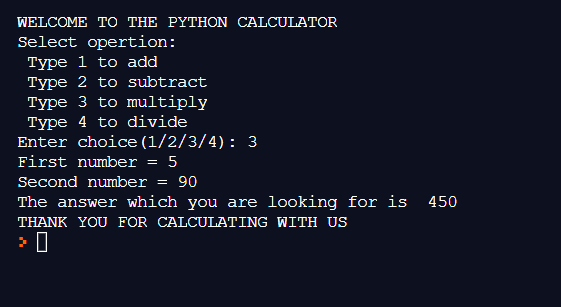

# Calculator
This is a calculator built using Python.
In this project you can learn how to `input` something from a user, `print` things and `if`,`elif`,`else` statements.
You can also learn how to do _add_,_subtract_,_multiply_ and _divide_ using Python.
I did this project because this is must to do when you are a beginner.
So you must try this project if you are new to Python.

I have shared the `output` for referrence.
Hope it helps.

